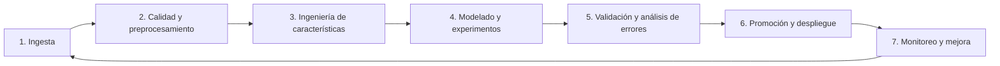

# Comparación externa, requisitos y fases del proyecto

**Proyecto:** Climate Veritas  
**Propósito:** documento de apoyo para presentación académica y defensa técnica.  
**Fecha:** 13 de agosto de 2026

## 1. Plataforma externa/china y estado del arte

### Referencia seleccionada

La referencia china propuesta para comparación es **MCFEND (Multi-source Benchmark Dataset for Chinese Fake News Detection)**, presentada en WWW 2024. El trabajo utiliza noticias verificadas por 14 agencias y considera múltiples fuentes chinas, entre ellas Weibo, WeChat, Douyin y medios de noticias. En su experimento piloto también usa casos de la **China Internet Joint Rumor Refuting Platform**, plataforma gubernamental china de refutación de rumores. [Artículo MCFEND](https://arxiv.org/abs/2403.09092).

No se ha identificado una plataforma china pública con la misma tarea exacta de Climate Veritas: clasificación textual y explicable de afirmaciones **ambientales/climáticas** en inglés, complementada con reglas ontológicas. Por ello MCFEND es una referencia de estado del arte en *fake-news detection* chino y multifuente, **no un competidor directamente equivalente**.

### Resultados externos reportados

| Sistema / protocolo | Dataset o tarea | Métrica reportada | Resultado |
|---|---|---:|---:|
| BERT-EMO | Weibo-21, mismo dominio/fuente | Macro-F1 | 0.980 |
| BERT-EMO | Evaluación cruzada hacia datos multifuente MCFEND | Macro-F1 | 0.818 ± 0.008 |
| BERT-EMO | Experimento piloto al cambiar de Weibo-21 a datos multifuente | F1 reportado por el artículo | 0.943 → 0.470 |
| Climate Veritas `holdout_bert` | Holdout climático propio, 200 claims excluidos del entrenamiento | Accuracy / Macro-F1 | 0.8250 / 0.8237 |
| Climate Veritas `holdout_bert` | Mismo holdout climático | Precisión / Recall / F1 de FAKE | 0.7778 / 0.9100 / 0.8387 |

MCFEND reporta que métodos entrenados en una sola fuente pueden perder capacidad al evaluarse en fuentes nuevas; su resultado ilustra por qué la validación externa es necesaria. Las métricas externas anteriores provienen del artículo y sus tablas experimentales; no deben leerse como una comparación *head-to-head* con Climate Veritas. [PDF del artículo](https://openreview.net/pdf/4acbddd4a8f405e02ef9edbad9047b41c9691e1a.pdf).

### Comparación técnica honesta

| Aspecto | MCFEND / enfoque chino de referencia | Climate Veritas |
|---|---|---|
| Idioma y dominio | Chino; noticias generales de diversas fuentes | Mayoritariamente inglés; afirmaciones ambientales |
| Modalidades | Texto, contexto social y en varios enfoques contenido multimodal | Texto, conocimiento simbólico y evidencia curada; sin análisis de imagen actual |
| Clasificación | Modelos de detección estadística/multimodal | TF-IDF + BERT-tiny + Random Forest + reglas + evidencia selectiva |
| Explicabilidad | Depende del modelo usado; no es el foco principal de todos los baselines | Entidades, conceptos, regla aplicada, fuente de decisión y evidencia cuando es fuerte |
| Negaciones críticas | No se puede afirmar que MCFEND las resuelva mediante reglas sin evaluación específica | Stop words preservan negación y reglas cubren negaciones climáticas canónicas en inglés/español |
| Seguridad | Métricas de clasificación | Reglas de contradicción con prioridad; por ejemplo, negar el efecto del CO2 fuerza `FAKE` |

### ¿Nuestra arquitectura supera al enfoque externo?

No se puede afirmar una superioridad global, porque cambian idioma, dataset, fuentes, modalidad y protocolo. Una cifra de 0.825 no es comparable directamente con 0.818 de MCFEND.

Lo que sí aporta Climate Veritas, por diseño, es:

1. **Manejo explícito de negaciones críticas.** Se conservaron `no`, `not`, `never`, `without` y se añadieron pruebas de regresión para frases como “CO2 has no impact on global warming”.
2. **Explicabilidad operativa.** La API devuelve entidades, enlaces ontológicos, conflictos, fuente de decisión y evidencia recuperada si cumple el umbral.
3. **Reglas de seguridad delimitadas.** Contradicciones climáticas canónicas tienen prioridad sobre el clasificador estadístico. También hay soporte solo para relaciones positivas muy restringidas, no para cualquier frase ambiental.
4. **Trazabilidad.** Cada predicción se persiste y los datos de evidencia guardan su fuente/URL cuando está disponible.

Sus límites frente a los enfoques multifuente chinos son también claros: Climate Veritas aún no procesa imágenes, propagación social ni una colección amplia de fuentes/idiomas. Para demostrar una mejora real se debe evaluar ambos enfoques en el mismo benchmark climático, multilingüe y sin fuga de datos.

## 2. Requisitos funcionales (RF)

Los siguientes requisitos se formalizaron a partir de la API y el frontend implementados.

| ID | Requisito funcional | Estado |
|---|---|---|
| RF-01 | El sistema debe recibir una publicación de texto y clasificarla como `REAL` o `FAKE`. | Implementado: `POST /predict` |
| RF-02 | El sistema debe extraer o normalizar una afirmación (`claim`) a partir del texto de entrada. | Implementado |
| RF-03 | El sistema debe detectar entidades ambientales y devolver texto, normalización y tipo cuando estén disponibles. | Implementado: spaCy + diccionario |
| RF-04 | El sistema debe enlazar entidades con conceptos ambientales y detectar conflictos ontológicos. | Implementado: RDFLib y reglas locales |
| RF-05 | El sistema debe generar una explicación y señalar la fuente de decisión: modelo, regla o evidencia. | Implementado |
| RF-06 | El sistema debe recuperar evidencia curada solo cuando la similitud sea suficientemente fuerte. | Implementado |
| RF-07 | El sistema debe persistir predicciones individuales y por lote con fecha, texto, resultado y explicación. | Implementado: PostgreSQL |
| RF-08 | El sistema debe procesar lotes de 1 a 100 textos. | Implementado: `POST /batch_predict` |
| RF-09 | El sistema debe permitir consultar el historial reciente de análisis. | Implementado: `GET /history` |
| RF-10 | El sistema debe exponer métricas, ablaciones y experimentos guardados. | Implementado: `/metrics`, `/ablation`, `/experiments` |
| RF-11 | El frontend debe permitir analizar texto, consultar historial y visualizar resultados experimentales. | Implementado: Next.js |
| RF-12 | El frontend debe exportar métricas en JSON e historial en CSV. | Implementado |
| RF-13 | El sistema debe poder ejecutar una evaluación controlada del modelo promovido contra el holdout. | Implementado: `POST /evaluation/holdout` |

## 3. Requisitos no funcionales (RNF)

| ID | Requisito no funcional | Criterio de verificación / estado |
|---|---|---|
| RNF-01 | **Seguridad de ejecución:** el frontend no debe ejecutar comandos arbitrarios en el servidor. | El endpoint de evaluación no recibe rutas, comandos ni nombres de modelos. |
| RNF-02 | **Explicabilidad:** cada predicción debe informar fuente de decisión y explicación. | `decision_source`, `verification_status`, entidades, conflictos y evidencia. |
| RNF-03 | **Trazabilidad:** las predicciones deben poder auditarse. | Tabla `prediction_history`. |
| RNF-04 | **Reproducibilidad:** modelo, vectorizador, configuración y métricas deben persistirse. | Artefactos en `app/models/` y `app/models/experiments/`. |
| RNF-05 | **Robustez frente a negación:** no se deben eliminar términos de negación críticos en el preprocesamiento. | Lista de stop words consciente de negación y pruebas de regresión. |
| RNF-06 | **Disponibilidad local:** API y frontend deben iniciar de forma independiente. | Uvicorn/FastAPI y Next.js, con `GET /health`. |
| RNF-07 | **Compatibilidad de desarrollo:** frontend y backend deben comunicarse desde localhost mediante CORS. | CORS configurado para `localhost` y `127.0.0.1`. |
| RNF-08 | **Rendimiento razonable en CPU:** la inferencia debe poder funcionar sin GPU. | BERT-tiny como encoder de 128 dimensiones; evaluación puede tardar minutos. |
| RNF-09 | **Integridad de evaluación:** el holdout no debe incluirse en el entrenamiento del modelo comparado. | `--exclude-claims-file` y evaluación separada. |
| RNF-10 | **Honestidad métrica:** no se deben presentar métricas de protocolos distintos como una sola comparación directa. | UI/documentación separan holdout, split interno y CV. |

## 4. Muestras del dataset y resultados esperados

Las siguientes frases son casos representativos de prueba. No sustituyen evidencia científica primaria; se usan para comprobar la lógica implementada.

| Tipo esperado | Texto de prueba | Resultado esperado | Motivo |
|---|---|---|---|
| REAL | `Carbon dioxide is a greenhouse gas that contributes to global warming.` | REAL | Relación positiva canónica respaldada por regla ontológica. |
| FAKE | `CO2 has no impact on global warming.` | FAKE | Niega una relación canónica; conflicto ontológico. |
| REAL | `Methane is a greenhouse gas and reducing methane emissions can help limit warming.` | REAL | Relación canónica de metano; soporte ontológico. |
| FAKE | `Methane is not a greenhouse gas.` | FAKE | Negación de relación canónica. |
| REAL | `El dióxido de carbono contribuye al calentamiento global.` | REAL | Alias español y regla de soporte. |
| FAKE | `El dióxido de carbono no tiene impacto en el cambio climático.` | FAKE | Alias español y regla de contradicción. |

### Metas iniciales y resultado alcanzado

| Meta inicial | Resultado actual |
|---|---|
| Construir una base PostgreSQL para datos y trazabilidad | Completado: `dataset_records`, `dataset_evidence`, `prediction_history`. |
| Entrenar un clasificador binario ambiental | Completado: Random Forest híbrido con BERT-tiny. |
| Alcanzar al menos una validación sólida y explicable | Holdout excluido: 82.50% accuracy, 82.37% macro-F1. |
| Priorizar detección de desinformación | Recall FAKE de 91.00% en holdout. |
| Incorporar componente neuro-simbólico | Completado: NER, RDFLib, reglas, evidencia selectiva. |
| Exponer una aplicación usable | Completado: FastAPI, Next.js, historial, métricas y evaluación. |

## 5. Fases del proceso

En este proyecto, “fases” se refiere a las fases metodológicas de desarrollo de software y ciencia de datos, no a un componente meteorológico. El flujo utilizado es:

| Fase | Actividades realizadas | Entregable |
|---|---|---|
| 1. Ingesta | Lectura de Climate-FEVER enriquecido, ClimateCheck y ClimaFactsKG; carga en PostgreSQL. | `dataset_records` y `dataset_evidence` |
| 2. Calidad y preprocesamiento | Exclusión de etiquetas ambiguas, deduplicación, normalización y preservación de negaciones. | Dataset de entrenamiento controlado |
| 3. Ingeniería de características | TF-IDF, n-gramas, legibilidad, NER, entity linking, conflictos y embeddings. | Matrices de características |
| 4. Modelado | Random Forest híbrido, baseline Transformer+LR, TF-IDF palabra/carácter y ablaciones. | Experimentos persistidos |
| 5. Validación | Split estratificado, CV 5-fold, benchmark retenido y análisis de errores. | `metrics.json`, `holdout_evaluation.json` |
| 6. Despliegue | Promoción de `holdout_bert`, FastAPI, PostgreSQL y Next.js. | Aplicación local operativa |
| 7. Monitoreo y mejora | Historial, E2E, exportación y reevaluación controlada. | Trazabilidad para nuevas iteraciones |

No se implementó un módulo de predicción meteorológica, estaciones, clima en tiempo real ni series temporales atmosféricas. Si el término “fases” se refería a un componente meteorológico particular, ese requerimiento debe especificarse como una ampliación distinta del alcance actual.

## 6. Conclusión para presentación

Climate Veritas no se presenta como una plataforma que “vence” sin matices a MCFEND u otros sistemas chinos: los benchmarks no son equivalentes. Su contribución diferencial es una arquitectura orientada a *fact-checking* ambiental explicable: combinación de representación contextual, clasificación supervisada, tratamiento explícito de negación, reglas de seguridad, recuperación selectiva de evidencia y trazabilidad completa. La evidencia cuantitativa más sólida de este proyecto es el holdout propio excluido del entrenamiento: **82.50% de accuracy, 82.37% de macro-F1 y 91.00% de recall para FAKE**.
